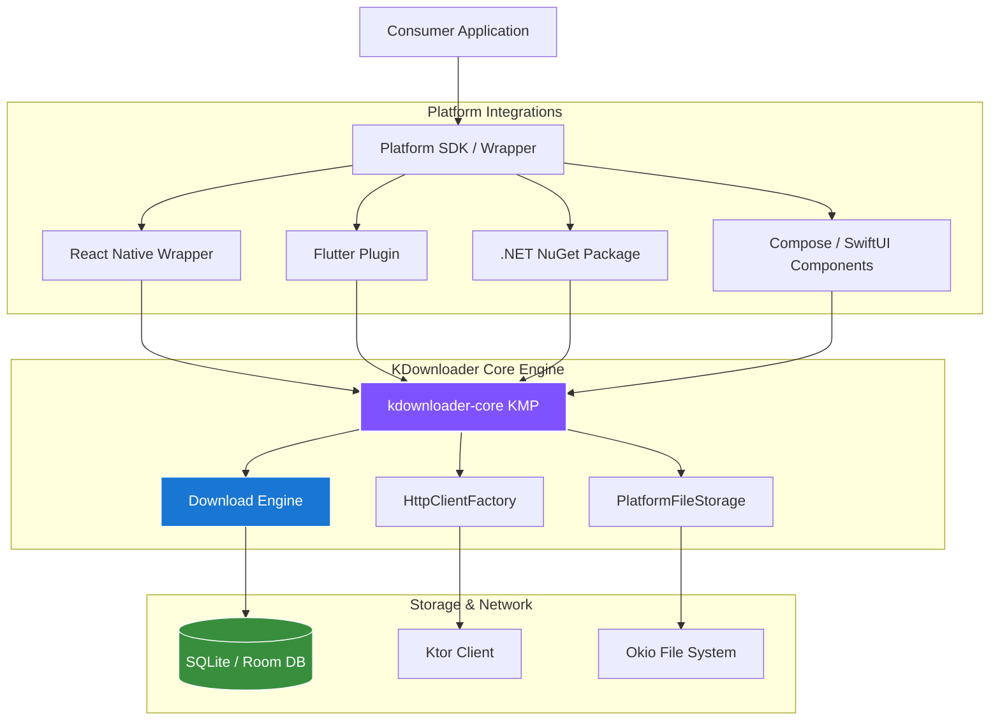

<p align="center">
  
</p>

<p align="center">
  <a href="https://github.com/RoxyBasicNeedBot/KDownloader/actions/workflows/build-and-test.yml">
    
  </a>
  <a href="https://jitpack.io/#RoxyBasicNeedBot/KDownloader">
    
  </a>
  <a href="https://www.npmjs.com/package/kdownloader-react-native">
    
  </a>
  <a href="https://pub.dev/packages/kdownloader_flutter">
    
  </a>
  <a href="LICENSE">
    
  </a>
  
</p>

---

A modern, Kotlin-first **cross-platform download engine** designed for maximum speed and reliability. Featuring multi-chunk parallel downloading, dynamic chunk splitting, mirror server support, token-bucket speed throttling, and WorkManager persistence.

Provides first-class, idiomatic SDKs for **Android, iOS/macOS (Swift), Desktop (JVM), C# (.NET), Flutter (Dart), and React Native**.

---

## ✨ Features

- 🚀 **Dynamic Chunk Splitting**: IDM-style dynamic range theft automatically shifts workload from slow streams to faster connections.
- 📂 **Multi-Chunk Parallel Downloading**: Splits files into multiple segments and downloads them concurrently.
- 🪞 **Mirror Downloads**: Round-robin mirror server assignment for concurrent downloading from alternative sources.
- 🛡️ **WorkManager & Background Persistence**: Survives application termination and device reboots (Android 14-16 compliant).
- 📶 **Network Awareness**: Auto-pauses on network loss and auto-resumes when connection is restored.
- ⏱️ **Speed Throttling**: Configure global or per-task download speed caps using token-bucket rate limiting.
- 🔑 **Comprehensive Auth**: Built-in support for Basic, Bearer, Digest, and OAuth credentials.
- 🔗 **Clipboard Sniffer**: Automatically checks clipboard copy operations for downloadable link patterns.
- 📦 **Post-Processing Hooks**: Chains operations like auto-extracting (ZIP/TAR/GZ) and hashing (MD5, SHA-256).

---

## 🛠️ Architecture



---

## 📦 Installation & Setup

### 1. Kotlin Multiplatform / JVM / Android (JitPack)

Add the JitPack repository to your configuration:

```kotlin
// settings.gradle.kts or build.gradle.kts
repositories {
    mavenCentral()
    maven { url = uri("https://jitpack.io") }
}
```

Then add the dependency for the core engine or platform-specific wrappers:

```kotlin
// build.gradle.kts
dependencies {
    // Pure Kotlin Multiplatform Core
    implementation("com.github.RoxyBasicNeedBot.KDownloader:kdownloader-core:v3.2.2")

    // Android Library (WorkManager, Notifications)
    implementation("com.github.RoxyBasicNeedBot.KDownloader:kdownloader-android:v3.2.2")

    // Compose Multiplatform UI components
    implementation("com.github.RoxyBasicNeedBot.KDownloader:kdownloader-compose:v3.2.2")

    // Dagger Hilt Integration
    implementation("com.github.RoxyBasicNeedBot.KDownloader:kdownloader-hilt:v3.2.2")

    // Desktop JVM Support
    implementation("com.github.RoxyBasicNeedBot.KDownloader:kdownloader-desktop:v3.2.2")
}
```

### 2. React Native (npm)

Install the wrapper module directly from npm:

```bash
npm install kdownloader-react-native
```

### 3. Flutter (pub.dev)

Add the plugin to your `pubspec.yaml`:

```yaml
dependencies:
  kdownloader_flutter: ^2.2.0
```

### 4. iOS (Swift Package Manager)

Add the package via Xcode or through your `Package.swift`:

```swift
dependencies: [
    .package(url: "https://github.com/RoxyBasicNeedBot/KDownloader.git", from: "3.2.2")
]
```

### 5. C# (.NET NuGet)

Install the C# NuGet package:

```bash
dotnet add package KDownloader.Net --version 3.2.2
```

---

## 💻 Idiomatic Usage Examples

### 🟣 Kotlin (Android / Desktop)

```kotlin
val downloader = KDownloader.getInstance(context)

val id = downloader.enqueue(
    DownloadRequest.Builder("https://example.com/largefile.zip", "/downloads/", "file.zip")
        .setPriority(DownloadPriority.HIGH)
        .setChunkCount(8)
        .setWifiOnly(true)
        .setSpeedLimit(2_000_000) // 2 MB/s cap
        .addMirrorUrl("https://mirror.example.com/file.zip")
        .build()
)

// Observe download progress reactively
downloader.observe(id).collect { state ->
    when (state) {
        is DownloadState.Downloading -> println("${state.progress.percent}% at ${state.progress.speedFormatted}")
        is DownloadState.Done -> println("Saved to ${state.result.filePath}")
        is DownloadState.Failed -> println("Failed: ${state.error.message}")
        else -> Unit
    }
}
```

### 🍎 Swift (iOS / macOS)

```swift
let downloader = KDownloader.shared

let id = try await downloader.enqueue(
    DownloadRequest(
        url: "https://example.com/movie.mp4",
        destination: .documentsDirectory,
        fileName: "movie.mp4",
        chunkCount: 6
    )
)

// Exhaustive Swift matching via SKIE interop
for await state in downloader.observe(id) {
    switch state {
    case .downloading(let progress):
        print("\(progress.percent)% downloaded")
    case .done(let result):
        print("Completed: \(result.filePath)")
    case .failed(let error, _):
        print("Error: \(error.localizedDescription)")
    default: break
    }
}
```

### ⚛️ React Native (TypeScript)

```typescript
import KDownloader from 'kdownloader-react-native';

const id = await KDownloader.enqueue({
  id: 'task-1',
  url: 'https://example.com/file.zip',
  destinationDir: '/downloads',
  fileName: 'file.zip',
  chunkCount: 4
});

KDownloader.observe((states) => {
  const task = states.find(s => s.id === id);
  if (task && task.status === 'DOWNLOADING') {
    console.log(`${task.progress.percent}% | ${task.progress.speedFormatted}`);
  }
});
```

### 🐦 Dart (Flutter)

```dart
import 'package:kdownloader_flutter/kdownloader_flutter.dart';

final downloader = KDownloaderFlutter();
final id = await downloader.enqueue(
  DownloadRequest(
    url: 'https://example.com/file.zip',
    destinationDir: '/downloads/',
    fileName: 'file.zip',
    chunkCount: 4,
  )
);

downloader.observe(id).listen((state) {
  if (state is Downloading) {
    print('${state.progress.percent}%');
  } else if (state is Done) {
    print('Downloaded: ${state.result.filePath}');
  }
});
```

---

## 📄 License

This project is licensed under the BSD 3-Clause License - see the [LICENSE](LICENSE) file for details.

